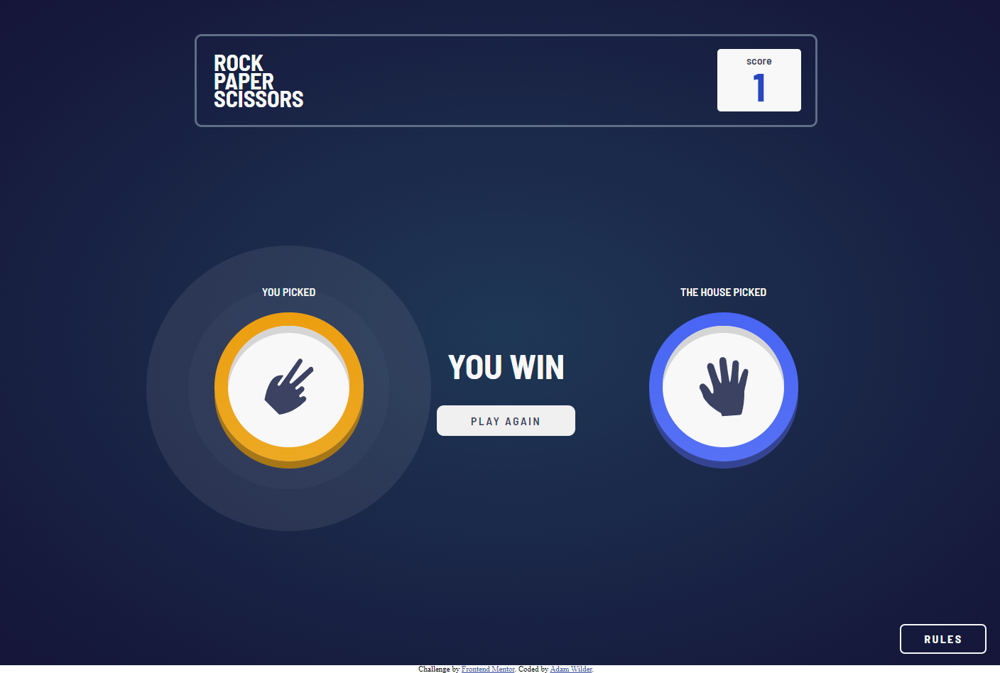

# Frontend Mentor - Rock Paper Scissors Solution

This is a solution to the [Rock paper scissor game challenge on Frontend Mentor](https://www.frontendmentor.io/challenges/rock-paper-scissors-game-pTgwgvgH/hub). Frontend Mentor challenges help you improve your coding skills by building realistic projects.

## Table of contents

- [Overview](#overview)
  - [Screenshot](#screenshot)
  - [Links](#links)
- [My process](#my-process)
  - [Built with](#built-with)
- [Author](#author)

## Overview

### Screenshot

### Links

- [Live Site URL](https://adamsrockpaperscissors.netlify.app/)

## My process

### Built with

- Semantic HTML5 markup
- CSS custom properties
- Vanilla Javascript
- Flexbox
- CSS Grid
- Mobile-first workflow
- [Sass](https://sass-lang.com/)

## Author

- Website - [Adam Wilder](https://www.adamwilder.fun)
- Frontend Mentor - [@wilderav86](https://www.frontendmentor.io/profile/wilderav86)
